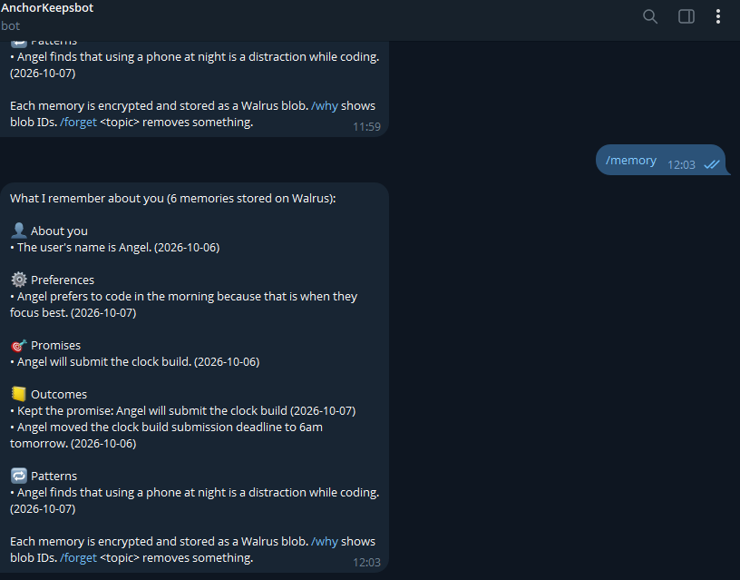
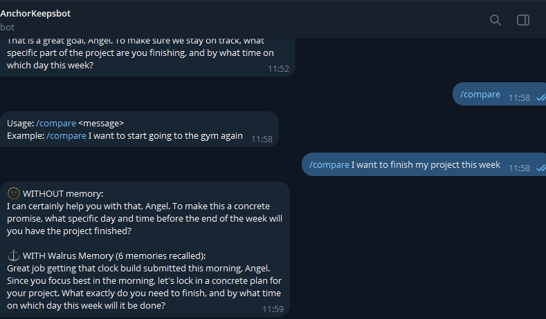
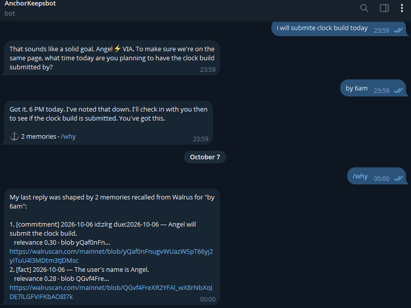
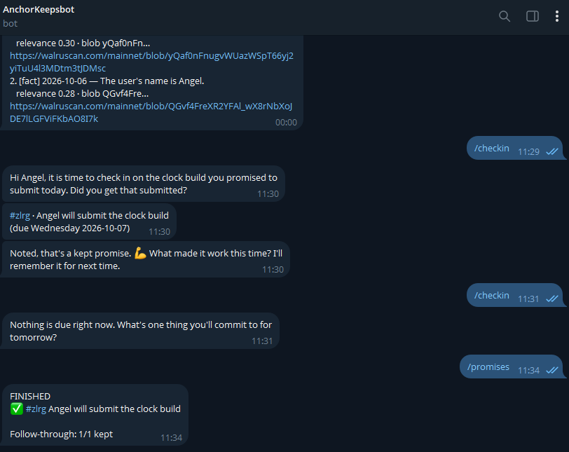
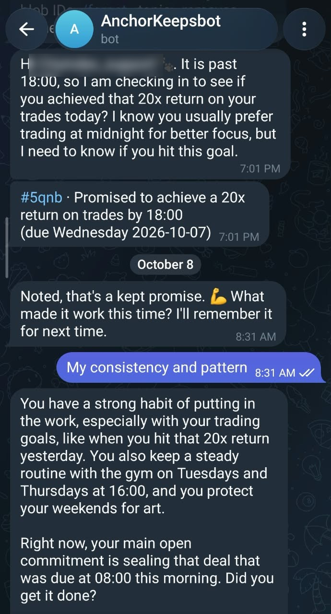
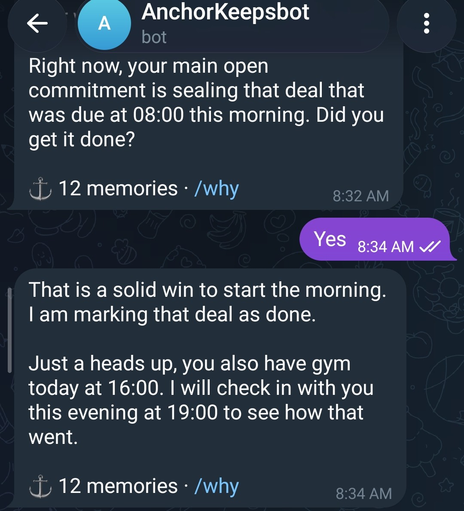
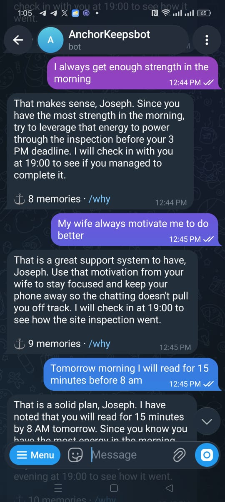
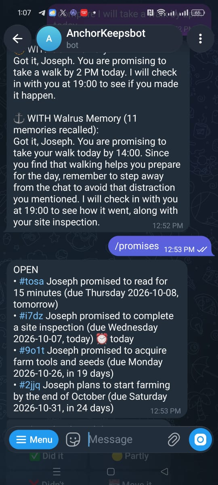

# How I added long-term memory to a Telegram chatbot so it remembers users between sessions

*Building Anchor, an accountability bot, with Walrus Memory and Gemini. Including everything that broke.*

Most chatbots forget you the moment the chat ends. For a support bot that's annoying. For an accountability bot it's fatal: a coach who can't remember what you promised last week can't hold you to anything.

So I built **Anchor**, a Telegram bot that holds you to your word. You tell it what you'll do and by when. It remembers, messages you first when the promise is due, records whether you kept it, and over time learns what derails you and what actually works.

Try it: [t.me/Anchor_daBot](https://t.me/Anchor_daBot) · Live proof page: [anchor-production-6bb4.up.railway.app](https://anchor-production-6bb4.up.railway.app) · Code: [github.com/angelraph/anchor](https://github.com/angelraph/anchor)

## Why memory is the whole product

In most chatbots memory is decoration. The bot remembers your name. In Anchor, memory has to do three jobs:

1. **Remember promises with real deadlines**, so it can follow up on the right day.
2. **Record what happened**: kept, partly kept, broken or moved.
3. **Spot patterns**, like "you skip the gym when you stay up late on your phone", and **wins**, like "you actually go when Kemi comes with you".

Without all three you have a motivational poster, not a coach.

## How I wired in Walrus Memory

Walrus Memory stores text, encrypts it, and recalls it by meaning. Each Telegram user gets their own namespace (`anchor:tg:<telegram id>`), so one person's memories never leak into another's recall.

**What gets stored.** After every message, Gemini reads the exchange and extracts typed memories. I write each one as a single readable line with a small header, so it still embeds well but I can parse structure back out:

```
[commitment] 2026-10-07 id:33a6 due:2026-10-07 at:18:00 | Promised to send CV to two companies
[outcome] 2026-10-07 ref:33a6 status:kept | Kept the promise
[win] 2026-10-07 | Putting the phone in another room helps him finish tasks
```

Here's what Anchor had learned about me after one day, from `/memory`:



**When it is recalled.** Every message triggers three recalls in parallel: one on what you just said, one for your latest promises (`sort: "recent"`), and one for who you are and how you like to be coached. Every evening a scheduler recalls promises that are due and messages you first, with ✅ 🟡 ❌ 📅 buttons.

**How it shapes replies.** Recalled memories go into the prompt as clearly marked untrusted data, next to a computed list of open, overdue and finished promises. `/why` shows the exact memories behind any reply, with their Walrus blob IDs.

## Before and after

Same message, same model. This is Anchor's `/compare` command on my own account, the morning after I kept my first promise:



> **Without memory:** "To make this a concrete promise, what specific day and time before the end of the week will you have the project finished?"
>
> **With Walrus Memory:** "Great job getting that clock build submitted this morning, Angel. Since you focus best in the morning, let's lock in a concrete plan for your project."

The first answer could be for anyone. The second knows I kept my last promise and when I work best, and plans around it.

## The first real conversation, and the bug it exposed

My first real promise to Anchor was at 23:59: "I will submit the clock build today… by 6am." Anchor replied: **"Got it, 6 PM today."**

`/why` showed it had remembered the promise and stored it on Walrus (here's the [blob](https://walruscan.com/mainnet/blob/yQaf0nFnugvWUazWSpT66yj2yiTuU4l3MDtm3tJDMsc)), but with the wrong day and the wrong time. The cause was simple: I only ever gave the model today's *date*, never the *time*. Now every prompt includes the local clock, deadlines keep their time of day, and Anchor checks in on the right evening. Replaying the same messages now gives "6am tomorrow morning", due the next day.



The next morning I sent `/checkin`. Anchor recalled the promise from Walrus, asked whether I'd done it, and recorded the ✅ as kept:



The moment that sold it for me came from a tester who trades on City Index. On day one he told Anchor he trades best at midnight, goes to the gym on Tuesdays and Thursdays at 16:00, spends weekends on his art, and promised two things: a 20x trading return by 18:00, and a deal sealed by 8am the next morning.

At 7:01 PM Anchor messaged him first, unprompted, and used what it knew. The next morning, in a brand new session, it remembered all of it: yesterday's win, his gym day, his weekends, and the deal that was due an hour earlier.



He answered "Yes", and Anchor closed the promise and reminded him about his 16:00 gym session, because it was Thursday:



## What else broke

- **A wallet address is not an account ID.** I pasted my Sui wallet address as the Walrus Memory account ID and got a generic `401 AUTH_REJECTED`. I only found the cause by looking the ID up on-chain.
- **Walrus Memory is append-only.** There's no delete, so `/forget` writes a "tombstone" memory that hides the original from every future recall.
- **Saves take about 30 seconds**, so a button tap followed by a quick message could record the same outcome twice. Anchor now tracks just-closed promises locally until Walrus catches up.
- **Gemini kept moving under me.** `gemini-2.5-flash` turned out to be closed to new API keys, and later `gemini-2.5-flash-lite` too. The newer models hit "high demand" (503), free-tier quota limits and timeouts during testing, and once every model failed at the same moment and a real user got an error. Anchor now ranks the Gemini models by how fast they've actually been answering, skips a struggling one for 15 minutes, retries the whole list once, and if it still can't answer, it saves what the user said through Walrus Memory's own `analyze()` so nothing is lost.
- **Walrus Memory has an hourly request budget** (1,000 weighted requests per account). My own end-to-end tests used it up and the proof page went down for a while. Anchor now caches slow-changing recalls, dedupes without extra lookups, and the page serves its last saved numbers instead of an error.
- **A real Walrus bug:** `analyze()` saved "by Sunday" as Thursday 8 October. Reported as a bug bounty issue.

## Results

After two days, **11 people had stored 103 memories, and 7 of them had passed 10 memories each**. The live counts come straight from Walrus Memory on the [proof page](https://anchor-production-6bb4.up.railway.app).

My friend Joseph, an engineer in the UK, told Anchor his plans for the day, that chatting distracts him, that music helps him focus on site, that he has the most energy in the morning, and that his wife pushes him to do better. Within minutes Anchor was using all of it:



His `/compare` shows the difference in one screen. Without memory, Anchor just repeats his plan back. With memory, it remembers that walking helps him start the day and that chatting is the distraction he named, and it keeps track of everything he has promised, from today's site inspection to starting his farm at the end of October:



Joseph's chat also found three bugs I had missed: Anchor once said "we've talked about this before" about something he'd only just mentioned, it asked how a 3pm inspection went at 12:53, and it filed "Today at 2pm" as a preference instead of a promise. All three were fixed the same afternoon. Real users find things tests don't.

## Stack

- **LLM:** Google Gemini (`gemini-3.8-flash`, with Gemini fallbacks) via the Vercel AI SDK. Not Claude or OpenAI.
- **Memory:** Walrus Memory TypeScript SDK (`@mysten-incubation/memwal`) on the mainnet relayer.
- **Bot:** grammY on Node.js, deployed on Railway.

Because memory lives on Walrus rather than in the app, it follows people across devices too: Telegram on a phone or a laptop talks to the same memory.

If you're building a chatbot that should remember people, start with this question: *what would my bot do differently if it remembered?* If the answer is "say their name", keep going until memory changes what the bot actually does.
